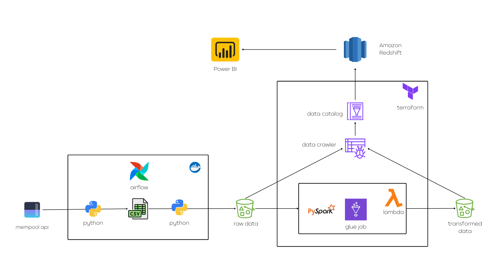
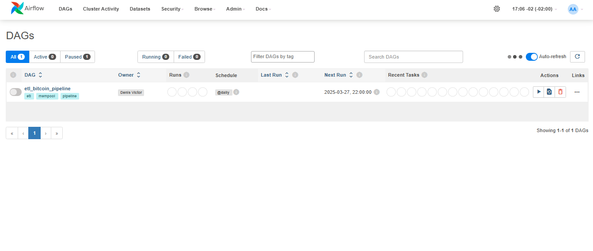
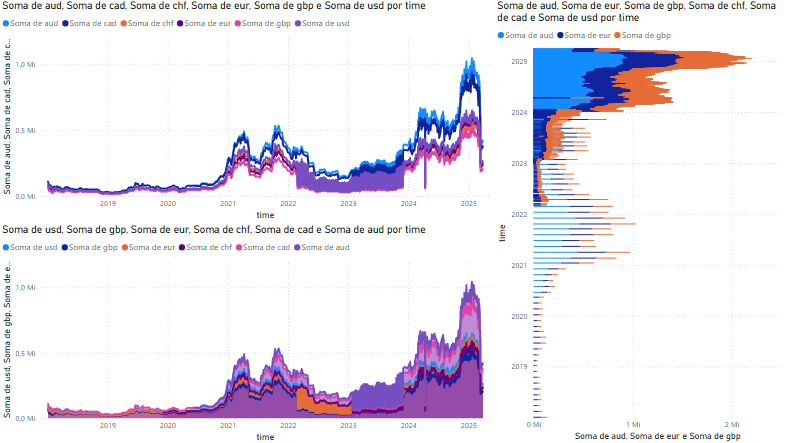

# ETL Bitcoin with Airflow, AWS, and Terraform

## Project Architecture



## Project Description

This project aims to extract Bitcoin price data over the years in different currencies using the Mempool API. The data goes through an ETL pipeline divided into two main stages:

1. **Extraction and Upload to AWS S3** (via Apache Airflow and Docker):
   - The first part of the Airflow DAG collects data from the Mempool API, converts timestamps into standard dates, and saves a CSV file locally.
   - The second part uploads this CSV to an AWS S3 bucket using Python and the `boto3` library.

2. **Processing and Storage in AWS** (via Terraform and AWS Glue):
   - Terraform is used to provision AWS resources.
   - An AWS Glue Crawler catalogs the data stored in the `raw/` folder in S3.
   - An AWS Glue Job (using PySpark) transforms the data, removes invalid values, and saves a new CSV in the `transformed_data/` folder in S3.
   - An AWS Lambda function is triggered when new files appear in the `raw/` folder, automatically activating the Crawler and Glue Job.
   - The transformed data is accessed by Amazon Redshift through the data catalog in a serverless cluster.

## Technologies Used
- **Apache Airflow**: Orchestrates DAGs for data extraction and upload.
- **Docker**: Containerizes the execution environment.
- **Python (`boto3`, `pandas`)**: Handles data processing and AWS upload.
- **AWS S3**: Stores raw and transformed data.
- **AWS Glue**: Catalogs and processes data with PySpark.
- **AWS Lambda**: Automates processing when new files are detected.
- **Amazon Redshift**: Accesses data through the data catalog.
- **Terraform**: Infrastructure as code for AWS resource provisioning.


## Project Structure
```
├───config
│   └───configuration.conf
├───dags
│   └───etl_bitcoin.py
├───data
├───etls
│   ├───mempool_etl.py
│   └───upload_s3_etl.py
├───pipelines
│   ├───mempool_pipeline.py
│   └───upload_s3_pipeline.py
├───terraform
│   ├───code
│   │   ├───lambda_code.py
│   │   └───script_bitcoin.py
│   ├───buckets.tf
│   ├───catalog_crawler.tf
│   ├───glue_job.tf
│   ├───glue_service_role.tf
│   ├───lambda_function.tf
│   ├───lambda_iam.tf
│   ├───providers.tf
│   ├───vars.tf
│   └───versions.tf
├───utils
│   └───constants.py
├───docker-compose.yaml
├───Dockerfile
├───requirements.txt
└───Readme.md
```

## How to Run

### 1. AWS Keys and Bucket Name
Set environment variables:
```sh
 set AWS_ACCESS_KEY_ID = your-access-key-id
 set AWS_SECRET_ACCESS_KEY = your-secret-access-key
 set AWS_DEFAULT_REGION = your-default-region
```
The Dockerfile automatically picks up these environment variables. Also, update the bucket name in `terraform/vars.tf` and `config/configuration.conf`. The bucket must be created beforehand.

### 2. Environment Setup
Ensure you have installed:
- Docker
- Terraform

### 3. Start Airflow
```sh
docker-compose up -d
```
Access the Airflow web UI at `http://localhost:8080` and activate the `etl_bitcoin_pipeline` DAG.



### 4. Provision AWS Infrastructure
Inside the `terraform/` directory, run:
```sh
terraform init
terraform apply
```
This will create AWS Glue (data catalog, Glue Job, Glue Crawler), Lambda, and the necessary IAM roles. Redshift must be created separately and connected to the data catalog.

### 5. Monitoring
- Check files in S3 (`raw/` and `transformed_data/` folders).
- Monitor job execution in AWS Glue.
- Query the data in Amazon Redshift.

### 6. Using the data
#### Connecting powerbi with the redshift to analyse the data



## Future Improvements
- Explore additional data sources to enrich analyses.
- Create S3 bucket and Redshift cluster with Terraform.
